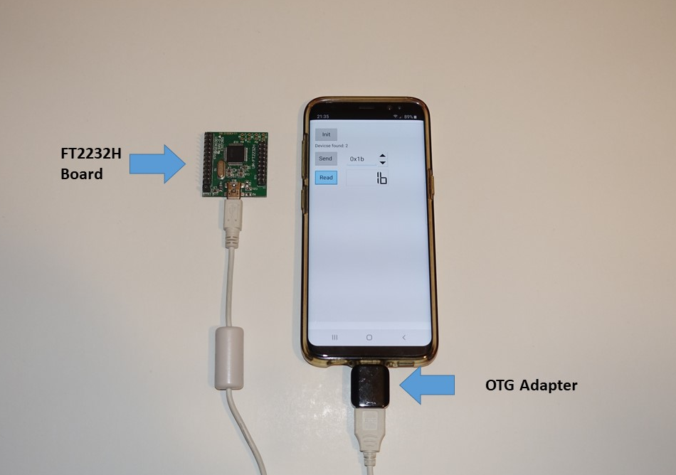
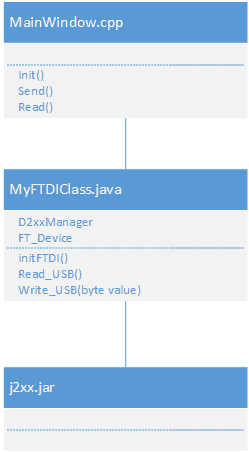

# QT USB BITBANG Mode example for Android using FTDI D2XX driver


This is a <B> QT </B> example for using the FTDI D2xx driver (*j2xx.jar*) on Android devices.
It just can send a value on “Channel A” and receive a value on “Channel B” via the FT2232H chipset.


## Overview


<br>
Just connect your FTDI Chip with an USB OTG adapter to your Android device.
To test the application, connect the Channel A  and Channel B (see table) with a jumper cable.
<br>


| Signal<br>Channel A   | FT2232H pin | Signal<br>Channel A     | FT2232H pin |
|--------   |-------------|-----------|-------------|
| D0        | 2           | D0        | 38          |
| D1        | 3           | D1        | 39          |
| D2        | 6           | D2        | 40          |
| D3        | 9           | D3        | 41          |
| D4        | 1           | D4        | 42          |
| D5        | 5           | D5        | 43          |
| D6        | 10          | D6        | 44          |
| D7        | 11          | D7        | 45          |


## Some information about the code

I wrote two classes. The QT Class MainWindow and the JAVA Class MyFTDIClass.
<br>

<p align="center">

</p>


<br>

I have encapsulated the control of the FTDI driver (j2xx.jar) in its own JAVA class (*MyFTDIClass*), this has the advantage that  I don't have to pass the objects *D2xxManager* and *FT_Device* to my *MainWindow* class via JNI.
I only provide the Init, Read and Write methods, which I can easily call using the "*QAndroidJniObject::callStaticMethod*" Method.

<br>

## AndroidManifest.xml

Changes to the Manifest file

```xml

<activity
 android:configChanges="orientation|uiMode|screenLayout|screenSize|smallestScreenSize|layoutDirection|locale|fontScale|keyboard|keyboardHidden|navigation"
	 android:name="org.usbexample.ftdi.MyFTDIClass"
	 android:label="-- %%INSERT_APP_NAME%% --"
	 android:screenOrientation="unspecified"
	 android:launchMode="singleTop">


<uses-feature android:name="android.hardware.usb.host"/>
    <intent-filter>
      <action android:name="android.hardware.usb.action.USB_DEVICE_ATTACHED"/>
    </intent-filter>
    <meta-data android:name="android.hardware.usb.action.USB_DEVICE_ATTACHED" android:resource="@xml/device_filter"/>


   ```

You have to change the android:name to

*android:name="org.usbexample.ftdi.MyFTDIClass"*


## QT Projekt File

For using the QAndroidJniObject, you have to add androidextras:

QT       += core gui androidextras

in your project file (usbexample&#46;pro)
